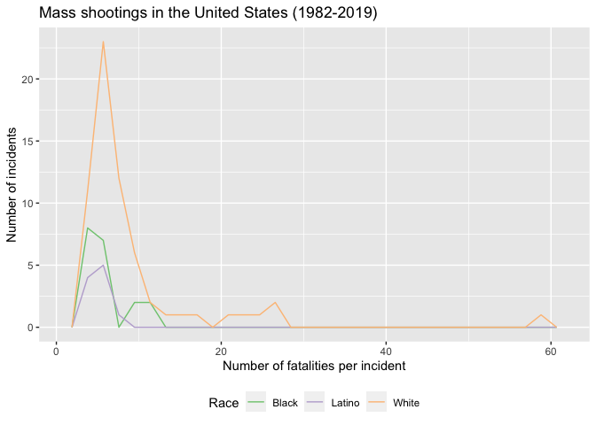
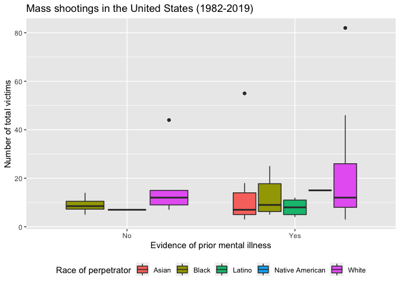

Exploring Mass Shootings in America
================
Benjamin Soltoff

## Get the data

``` r
library(tidyverse) # load tidyverse packages, including ggplot2
```

    ## ── Attaching packages ──────────────────────────────────────────────── tidyverse 1.2.1 ──

    ## ✔ ggplot2 3.2.1     ✔ purrr   0.3.2
    ## ✔ tibble  2.1.3     ✔ dplyr   0.8.3
    ## ✔ tidyr   1.0.0     ✔ stringr 1.4.0
    ## ✔ readr   1.3.1     ✔ forcats 0.4.0

    ## ── Conflicts ─────────────────────────────────────────────────── tidyverse_conflicts() ──
    ## ✖ dplyr::filter() masks stats::filter()
    ## ✖ dplyr::lag()    masks stats::lag()

``` r
library(knitr) # load functions for formatting tables

# get data from rcfss package
# install latest version if not already installed
# devtools::install_github("uc-cfss/rcfss")
library(rcfss)

# load the data
data("mass_shootings")
mass_shootings
```

    ## # A tibble: 114 x 14
    ##    case   year month   day location summary fatalities injured
    ##    <chr> <dbl> <chr> <int> <chr>    <chr>        <dbl>   <dbl>
    ##  1 Dayt…  2019 Aug       4 Dayton,… PENDING          9      27
    ##  2 El P…  2019 Aug       3 El Paso… PENDING         20      26
    ##  3 Gilr…  2019 Jul      28 Gilroy,… "Santi…          3      12
    ##  4 Virg…  2019 May      31 Virgini… "DeWay…         12       4
    ##  5 Harr…  2019 Feb      15 Aurora,… Gary M…          5       6
    ##  6 Penn…  2019 Jan      24 State C… Jordan…          3       1
    ##  7 SunT…  2019 Jan      23 Sebring… "Zephe…          5       0
    ##  8 Merc…  2018 Nov      19 Chicago… Juan L…          3       0
    ##  9 Thou…  2018 Nov       7 Thousan… Ian Da…         12      22
    ## 10 Tree…  2018 Oct      27 Pittsbu… "Rober…         11       6
    ## # … with 104 more rows, and 6 more variables: total_victims <dbl>,
    ## #   location_type <chr>, male <lgl>, age_of_shooter <dbl>, race <chr>,
    ## #   prior_mental_illness <chr>

## Generate a data frame that summarizes the number of mass shootings per year. Print the data frame as a formatted `kable()` table.

| Year | Number of mass shootings |
| ---: | -----------------------: |
| 1982 |                        1 |
| 1984 |                        2 |
| 1986 |                        1 |
| 1987 |                        1 |
| 1988 |                        1 |
| 1989 |                        2 |
| 1990 |                        1 |
| 1991 |                        3 |
| 1992 |                        2 |
| 1993 |                        4 |
| 1994 |                        1 |
| 1995 |                        1 |
| 1996 |                        1 |
| 1997 |                        2 |
| 1998 |                        3 |
| 1999 |                        5 |
| 2000 |                        1 |
| 2001 |                        1 |
| 2003 |                        1 |
| 2004 |                        1 |
| 2005 |                        2 |
| 2006 |                        3 |
| 2007 |                        4 |
| 2008 |                        3 |
| 2009 |                        4 |
| 2010 |                        1 |
| 2011 |                        3 |
| 2012 |                        7 |
| 2013 |                        5 |
| 2014 |                        4 |
| 2015 |                        7 |
| 2016 |                        6 |
| 2017 |                       11 |
| 2018 |                       12 |
| 2019 |                        7 |

Mass shootings (1982-2019)

| Year | Number of mass shootings |
| ---: | -----------------------: |
| 1982 |                        1 |
| 1984 |                        2 |
| 1986 |                        1 |
| 1987 |                        1 |
| 1988 |                        1 |
| 1989 |                        2 |
| 1990 |                        1 |
| 1991 |                        3 |
| 1992 |                        2 |
| 1993 |                        4 |
| 1994 |                        1 |
| 1995 |                        1 |
| 1996 |                        1 |
| 1997 |                        2 |
| 1998 |                        3 |
| 1999 |                        5 |
| 2000 |                        1 |
| 2001 |                        1 |
| 2003 |                        1 |
| 2004 |                        1 |
| 2005 |                        2 |
| 2006 |                        3 |
| 2007 |                        4 |
| 2008 |                        3 |
| 2009 |                        4 |
| 2010 |                        1 |
| 2011 |                        3 |
| 2012 |                        7 |
| 2013 |                        5 |
| 2014 |                        4 |
| 2015 |                        7 |
| 2016 |                        6 |
| 2017 |                       11 |
| 2018 |                       12 |
| 2019 |                        7 |

Mass shootings in the United States (1982-2019)

## Generate a bar chart that identifies the number of mass shooters associated with each race category. The bars should be sorted from highest to lowest.

<!-- --><!-- -->

## Generate a boxplot visualizing the number of total victims, by type of location. Redraw the same plot, but remove the Las Vegas Strip massacre from the dataset.

<!-- --><!-- -->

## How many white males with prior signs of mental illness initiated a mass shooting after 2000?

20 white males with prior signs of mental illness initiated a mass
shooting after 2000.

## Which month of the year has the most mass shootings? Generate a bar chart sorted in chronological order to provide evidence of your answer.

<!-- --><!-- -->

## How does the distribution of mass shooting fatalities differ between white and black shooters? What about white and latino shooters?

## Okay graphs

    ## `stat_bin()` using `bins = 30`. Pick better value with `binwidth`.

<!-- -->

    ## `stat_bin()` using `bins = 30`. Pick better value with `binwidth`.

<!-- -->

## A better graph

    ## `stat_bin()` using `bins = 30`. Pick better value with `binwidth`.

<!-- -->

    ## `stat_bin()` using `bins = 30`. Pick better value with `binwidth`.

<!-- -->

## Are mass shootings with shooters suffering from mental illness different from mass shootings with no signs of mental illness in the shooter? Assess the relationship between mental illness and total victims, mental illness and race, and the intersection of all three variables.

<!-- -->

<!-- --><!-- --><!-- -->

<!-- --><!-- -->

## Session info

``` r
devtools::session_info()
```

    ## ─ Session info ──────────────────────────────────────────────────────────
    ##  setting  value                       
    ##  version  R version 3.6.1 (2019-07-05)
    ##  os       macOS Mojave 10.14.6        
    ##  system   x86_64, darwin15.6.0        
    ##  ui       X11                         
    ##  language (EN)                        
    ##  collate  en_US.UTF-8                 
    ##  ctype    en_US.UTF-8                 
    ##  tz       America/Chicago             
    ##  date     2019-10-08                  
    ## 
    ## ─ Packages ──────────────────────────────────────────────────────────────
    ##  package      * version date       lib source        
    ##  assertthat     0.2.1   2019-03-21 [1] CRAN (R 3.6.0)
    ##  backports      1.1.4   2019-04-10 [1] CRAN (R 3.6.0)
    ##  broom          0.5.2   2019-04-07 [1] CRAN (R 3.6.0)
    ##  callr          3.3.1   2019-07-18 [1] CRAN (R 3.6.0)
    ##  cellranger     1.1.0   2016-07-27 [1] CRAN (R 3.6.0)
    ##  cli            1.1.0   2019-03-19 [1] CRAN (R 3.6.0)
    ##  colorspace     1.4-1   2019-03-18 [1] CRAN (R 3.6.0)
    ##  crayon         1.3.4   2017-09-16 [1] CRAN (R 3.6.0)
    ##  desc           1.2.0   2018-05-01 [1] CRAN (R 3.6.0)
    ##  devtools       2.2.0   2019-09-07 [1] CRAN (R 3.6.0)
    ##  digest         0.6.20  2019-07-04 [1] CRAN (R 3.6.0)
    ##  dplyr        * 0.8.3   2019-07-04 [1] CRAN (R 3.6.0)
    ##  DT             0.8     2019-08-07 [1] CRAN (R 3.6.0)
    ##  ellipsis       0.2.0.1 2019-07-02 [1] CRAN (R 3.6.0)
    ##  evaluate       0.14    2019-05-28 [1] CRAN (R 3.6.0)
    ##  fansi          0.4.0   2018-10-05 [1] CRAN (R 3.6.0)
    ##  forcats      * 0.4.0   2019-02-17 [1] CRAN (R 3.6.0)
    ##  fs             1.3.1   2019-05-06 [1] CRAN (R 3.6.0)
    ##  generics       0.0.2   2018-11-29 [1] CRAN (R 3.6.0)
    ##  ggplot2      * 3.2.1   2019-08-10 [1] CRAN (R 3.6.0)
    ##  glue           1.3.1   2019-03-12 [1] CRAN (R 3.6.0)
    ##  gtable         0.3.0   2019-03-25 [1] CRAN (R 3.6.0)
    ##  haven          2.1.1   2019-07-04 [1] CRAN (R 3.6.0)
    ##  highr          0.8     2019-03-20 [1] CRAN (R 3.6.0)
    ##  hms            0.5.1   2019-08-23 [1] CRAN (R 3.6.0)
    ##  htmltools      0.3.6   2017-04-28 [1] CRAN (R 3.6.0)
    ##  htmlwidgets    1.3     2018-09-30 [1] CRAN (R 3.6.0)
    ##  httr           1.4.1   2019-08-05 [1] CRAN (R 3.6.0)
    ##  jsonlite       1.6     2018-12-07 [1] CRAN (R 3.6.0)
    ##  knitr        * 1.24    2019-08-08 [1] CRAN (R 3.6.0)
    ##  labeling       0.3     2014-08-23 [1] CRAN (R 3.6.0)
    ##  lattice        0.20-38 2018-11-04 [1] CRAN (R 3.6.1)
    ##  lazyeval       0.2.2   2019-03-15 [1] CRAN (R 3.6.0)
    ##  lifecycle      0.1.0   2019-08-01 [1] CRAN (R 3.6.0)
    ##  lubridate      1.7.4   2018-04-11 [1] CRAN (R 3.6.0)
    ##  magrittr       1.5     2014-11-22 [1] CRAN (R 3.6.0)
    ##  memoise        1.1.0   2017-04-21 [1] CRAN (R 3.6.0)
    ##  modelr         0.1.5   2019-08-08 [1] CRAN (R 3.6.0)
    ##  munsell        0.5.0   2018-06-12 [1] CRAN (R 3.6.0)
    ##  nlme           3.1-140 2019-05-12 [1] CRAN (R 3.6.1)
    ##  pillar         1.4.2   2019-06-29 [1] CRAN (R 3.6.0)
    ##  pkgbuild       1.0.5   2019-08-26 [1] CRAN (R 3.6.0)
    ##  pkgconfig      2.0.2   2018-08-16 [1] CRAN (R 3.6.0)
    ##  pkgload        1.0.2   2018-10-29 [1] CRAN (R 3.6.0)
    ##  prettyunits    1.0.2   2015-07-13 [1] CRAN (R 3.6.0)
    ##  processx       3.4.1   2019-07-18 [1] CRAN (R 3.6.0)
    ##  ps             1.3.0   2018-12-21 [1] CRAN (R 3.6.0)
    ##  purrr        * 0.3.2   2019-03-15 [1] CRAN (R 3.6.0)
    ##  R6             2.4.0   2019-02-14 [1] CRAN (R 3.6.0)
    ##  rcfss        * 0.1.8   2019-08-27 [1] local         
    ##  RColorBrewer   1.1-2   2014-12-07 [1] CRAN (R 3.6.0)
    ##  Rcpp           1.0.2   2019-07-25 [1] CRAN (R 3.6.0)
    ##  readr        * 1.3.1   2018-12-21 [1] CRAN (R 3.6.0)
    ##  readxl         1.3.1   2019-03-13 [1] CRAN (R 3.6.0)
    ##  remotes        2.1.0   2019-06-24 [1] CRAN (R 3.6.0)
    ##  rlang          0.4.0   2019-06-25 [1] CRAN (R 3.6.0)
    ##  rmarkdown      1.15    2019-08-21 [1] CRAN (R 3.6.0)
    ##  rprojroot      1.3-2   2018-01-03 [1] CRAN (R 3.6.0)
    ##  rstudioapi     0.10    2019-03-19 [1] CRAN (R 3.6.0)
    ##  rvest          0.3.4   2019-05-15 [1] CRAN (R 3.6.0)
    ##  scales         1.0.0   2018-08-09 [1] CRAN (R 3.6.0)
    ##  sessioninfo    1.1.1   2018-11-05 [1] CRAN (R 3.6.0)
    ##  stringi        1.4.3   2019-03-12 [1] CRAN (R 3.6.0)
    ##  stringr      * 1.4.0   2019-02-10 [1] CRAN (R 3.6.0)
    ##  testthat       2.2.1   2019-07-25 [1] CRAN (R 3.6.0)
    ##  tibble       * 2.1.3   2019-06-06 [1] CRAN (R 3.6.0)
    ##  tidyr        * 1.0.0   2019-09-11 [1] CRAN (R 3.6.0)
    ##  tidyselect     0.2.5   2018-10-11 [1] CRAN (R 3.6.0)
    ##  tidyverse    * 1.2.1   2017-11-14 [1] CRAN (R 3.6.0)
    ##  usethis        1.5.1   2019-07-04 [1] CRAN (R 3.6.0)
    ##  utf8           1.1.4   2018-05-24 [1] CRAN (R 3.6.0)
    ##  vctrs          0.2.0   2019-07-05 [1] CRAN (R 3.6.0)
    ##  withr          2.1.2   2018-03-15 [1] CRAN (R 3.6.0)
    ##  xfun           0.9     2019-08-21 [1] CRAN (R 3.6.0)
    ##  xml2           1.2.2   2019-08-09 [1] CRAN (R 3.6.0)
    ##  yaml           2.2.0   2018-07-25 [1] CRAN (R 3.6.0)
    ##  zeallot        0.1.0   2018-01-28 [1] CRAN (R 3.6.0)
    ## 
    ## [1] /Library/Frameworks/R.framework/Versions/3.6/Resources/library
