Exploring Mass Shootings in America
================
Ojaswi Malik

## Get the data

``` r
library(tidyverse)    # load tidyverse packages, including ggplot2
```

    ## ── Attaching packages ───────────────────────────────────────────────────────────────────── tidyverse 1.3.0 ──

    ## ✓ ggplot2 3.3.0     ✓ purrr   0.3.4
    ## ✓ tibble  3.0.0     ✓ dplyr   0.8.5
    ## ✓ tidyr   1.0.2     ✓ stringr 1.4.0
    ## ✓ readr   1.3.1     ✓ forcats 0.5.0

    ## ── Conflicts ──────────────────────────────────────────────────────────────────────── tidyverse_conflicts() ──
    ## x dplyr::filter() masks stats::filter()
    ## x dplyr::lag()    masks stats::lag()

``` r
library(knitr)        # load functions for formatting tables

# get data from rcfss package
# install latest version if not already installed
# devtools::install_github("uc-cfss/rcfss")
library(rcfss)

# load the data
data("mass_shootings")
mass_shootings
```

    ## # A tibble: 114 x 14
    ##    case   year month   day location summary fatalities injured total_victims
    ##    <chr> <dbl> <chr> <int> <chr>    <chr>        <dbl>   <dbl>         <dbl>
    ##  1 Dayt…  2019 Aug       4 Dayton,… "PENDI…          9      27            36
    ##  2 El P…  2019 Aug       3 El Paso… "PENDI…         20      26            46
    ##  3 Gilr…  2019 Jul      28 Gilroy,… "Santi…          3      12            15
    ##  4 Virg…  2019 May      31 Virgini… "DeWay…         12       4            16
    ##  5 Harr…  2019 Feb      15 Aurora,… "Gary …          5       6            11
    ##  6 Penn…  2019 Jan      24 State C… "Jorda…          3       1             4
    ##  7 SunT…  2019 Jan      23 Sebring… "Zephe…          5       0             5
    ##  8 Merc…  2018 Nov      19 Chicago… "Juan …          3       0             3
    ##  9 Thou…  2018 Nov       7 Thousan… "Ian D…         12      22            34
    ## 10 Tree…  2018 Oct      27 Pittsbu… "Rober…         11       6            17
    ## # … with 104 more rows, and 5 more variables: location_type <chr>, male <lgl>,
    ## #   age_of_shooter <dbl>, race <chr>, prior_mental_illness <chr>

## Generate a data frame that summarizes the number of mass shootings per year. Print the data frame as a formatted `kable()` table.

``` r
yearly_data <- mass_shootings %>%
count(year)

column_names <- c('Year', 'Number of mass shootings') # Column Names for the kable()


knitr::kable(
  yearly_data,
  format = "html",
  caption = "Mass shootings in the United States (1982-2019)",
  col.names = column_names,
)
```

<table>

<caption>

Mass shootings in the United States (1982-2019)

</caption>

<thead>

<tr>

<th style="text-align:right;">

Year

</th>

<th style="text-align:right;">

Number of mass
shootings

</th>

</tr>

</thead>

<tbody>

<tr>

<td style="text-align:right;">

1982

</td>

<td style="text-align:right;">

1

</td>

</tr>

<tr>

<td style="text-align:right;">

1984

</td>

<td style="text-align:right;">

2

</td>

</tr>

<tr>

<td style="text-align:right;">

1986

</td>

<td style="text-align:right;">

1

</td>

</tr>

<tr>

<td style="text-align:right;">

1987

</td>

<td style="text-align:right;">

1

</td>

</tr>

<tr>

<td style="text-align:right;">

1988

</td>

<td style="text-align:right;">

1

</td>

</tr>

<tr>

<td style="text-align:right;">

1989

</td>

<td style="text-align:right;">

2

</td>

</tr>

<tr>

<td style="text-align:right;">

1990

</td>

<td style="text-align:right;">

1

</td>

</tr>

<tr>

<td style="text-align:right;">

1991

</td>

<td style="text-align:right;">

3

</td>

</tr>

<tr>

<td style="text-align:right;">

1992

</td>

<td style="text-align:right;">

2

</td>

</tr>

<tr>

<td style="text-align:right;">

1993

</td>

<td style="text-align:right;">

4

</td>

</tr>

<tr>

<td style="text-align:right;">

1994

</td>

<td style="text-align:right;">

1

</td>

</tr>

<tr>

<td style="text-align:right;">

1995

</td>

<td style="text-align:right;">

1

</td>

</tr>

<tr>

<td style="text-align:right;">

1996

</td>

<td style="text-align:right;">

1

</td>

</tr>

<tr>

<td style="text-align:right;">

1997

</td>

<td style="text-align:right;">

2

</td>

</tr>

<tr>

<td style="text-align:right;">

1998

</td>

<td style="text-align:right;">

3

</td>

</tr>

<tr>

<td style="text-align:right;">

1999

</td>

<td style="text-align:right;">

5

</td>

</tr>

<tr>

<td style="text-align:right;">

2000

</td>

<td style="text-align:right;">

1

</td>

</tr>

<tr>

<td style="text-align:right;">

2001

</td>

<td style="text-align:right;">

1

</td>

</tr>

<tr>

<td style="text-align:right;">

2003

</td>

<td style="text-align:right;">

1

</td>

</tr>

<tr>

<td style="text-align:right;">

2004

</td>

<td style="text-align:right;">

1

</td>

</tr>

<tr>

<td style="text-align:right;">

2005

</td>

<td style="text-align:right;">

2

</td>

</tr>

<tr>

<td style="text-align:right;">

2006

</td>

<td style="text-align:right;">

3

</td>

</tr>

<tr>

<td style="text-align:right;">

2007

</td>

<td style="text-align:right;">

4

</td>

</tr>

<tr>

<td style="text-align:right;">

2008

</td>

<td style="text-align:right;">

3

</td>

</tr>

<tr>

<td style="text-align:right;">

2009

</td>

<td style="text-align:right;">

4

</td>

</tr>

<tr>

<td style="text-align:right;">

2010

</td>

<td style="text-align:right;">

1

</td>

</tr>

<tr>

<td style="text-align:right;">

2011

</td>

<td style="text-align:right;">

3

</td>

</tr>

<tr>

<td style="text-align:right;">

2012

</td>

<td style="text-align:right;">

7

</td>

</tr>

<tr>

<td style="text-align:right;">

2013

</td>

<td style="text-align:right;">

5

</td>

</tr>

<tr>

<td style="text-align:right;">

2014

</td>

<td style="text-align:right;">

4

</td>

</tr>

<tr>

<td style="text-align:right;">

2015

</td>

<td style="text-align:right;">

7

</td>

</tr>

<tr>

<td style="text-align:right;">

2016

</td>

<td style="text-align:right;">

6

</td>

</tr>

<tr>

<td style="text-align:right;">

2017

</td>

<td style="text-align:right;">

11

</td>

</tr>

<tr>

<td style="text-align:right;">

2018

</td>

<td style="text-align:right;">

12

</td>

</tr>

<tr>

<td style="text-align:right;">

2019

</td>

<td style="text-align:right;">

7

</td>

</tr>

</tbody>

</table>

## Generate a bar chart that identifies the number of mass shooters associated with each race category. The bars should be sorted from highest to lowest.

``` r
data_without_na <- filter(.data = mass_shootings, !is.na(race)) # Cleaning the data of NA race values

ggplot(data = data_without_na) + 
  geom_bar(
    mapping = aes(x = forcats::fct_infreq(race)), 
    na.rm = TRUE
  ) + 
  labs(title = "Mass shootings in the United States (1982-2019)") +
  labs(x = "Race of perpetrator", y = "Number of incidents")
```

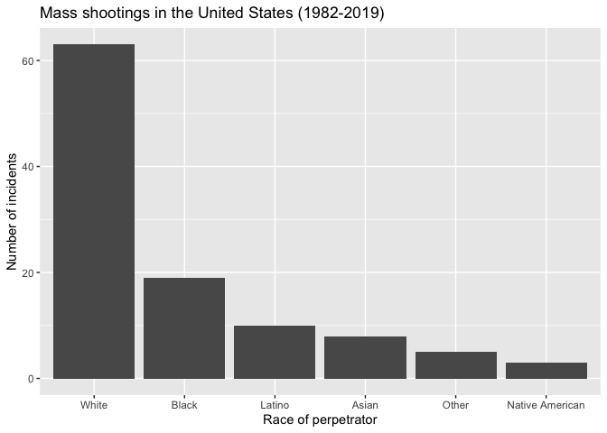<!-- -->

## Generate a boxplot visualizing the number of total victims, by type of location. Redraw the same plot, but remove the Las Vegas Strip massacre from the dataset.

``` r
ggplot(data = mass_shootings, 
       mapping = aes(x = location_type, y = total_victims)) +
  geom_boxplot() +
  labs(title = "Mass shootings in the United States (1982-2019)") +
  labs(x = "Type of location of incident", y = "Total number of victims")
```

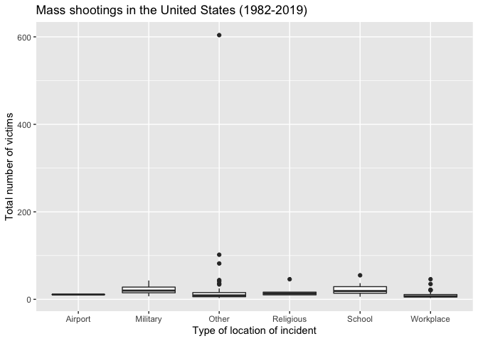<!-- -->

``` r
omitted_lvstrip <- filter(.data = mass_shootings, case!= "Las Vegas Strip massacre" ) # Filtering out the LV Strip Massacre

ggplot(data = omitted_lvstrip, 
       mapping = aes(x = location_type, y = total_victims)) +
  geom_boxplot() +
  labs(title = "Mass shootings in the United States (1982-2019)", subtitle = "Omitting Las Vegas Strip massacre") +
  labs(x = "Type of location of incident", y = "Total number of victims")
```

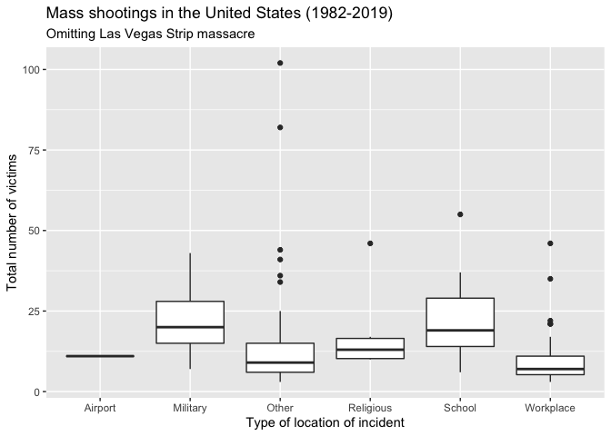<!-- -->

## How many white males with prior signs of mental illness initiated a mass shooting after 2000?

``` r
x <- filter(.data = mass_shootings, male == TRUE & race == "White" & prior_mental_illness == "Yes" & year > 2000)
count(x)
```

    ## # A tibble: 1 x 1
    ##       n
    ##   <int>
    ## 1    20

**Answer**: 20 white males with prior signs of mental illness initiated
a mass shooting after
2000.

## Which month of the year has the most mass shootings? Generate a bar chart sorted in chronological order to provide evidence of your answer.

``` r
months <- c("Jan", "Feb", "Mar", "Apr", "May", "Jun", "Jul", "Aug", "Sep", "Oct", "Nov", "Dec") #Ordering the months in chronological order to set as limit for the bar graph

ggplot(data = mass_shootings) +
  geom_bar( mapping = aes(x = month)) + 
   scale_x_discrete(limits = months) + 
  labs(title = "Mass shootings in the United States (1982-2019)") +
  labs(x = "Month", y = "Number of mass shootings")
```

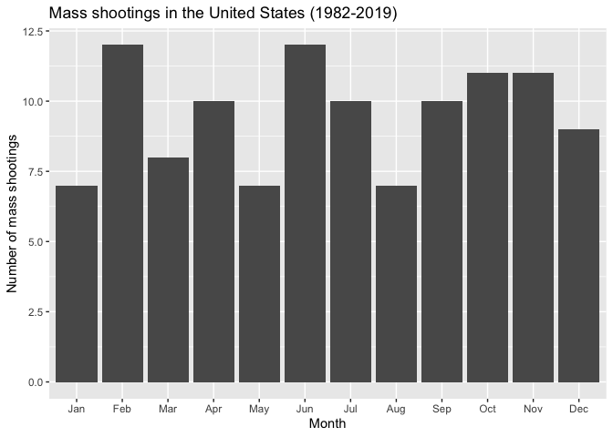<!-- -->

**Answer**: From the above bar graph we can see that both February and
June have the most mass shootings in the year. This is 12 mass shootings
in both these
months.

## How does the distribution of mass shooting fatalities differ between white and black shooters? What about white and latino shooters?

``` r
filter_race <- filter(.data = mass_shootings, race == "White" | race == "Black" | race == "Latino" ) #Filtering the data

ggplot( data = filter_race, mapping = aes(x = fatalities)) +
  geom_histogram() +
  facet_grid(~race, scales = "free") + 
  labs(title = "Mass shootings in the United States (1982-2019)") +
  labs(x = "Number of fatalities per incident", y = "Number of incidents")
```

    ## `stat_bin()` using `bins = 30`. Pick better value with `binwidth`.

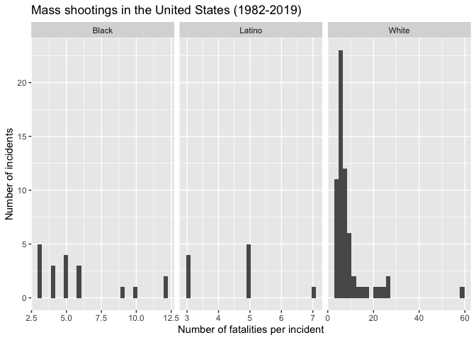<!-- -->

**Answer**:

  - *Difference in distribution of mass shooting fatalities between
    white and black shooters*: White shooters are more variable, with
    the highest number of fatalities being 58. Morever, they also have a
    larger number of incidents with fatalities in the range 3-10. In
    comparison, black shooters always have less than or equal to 5
    incidents of fatalities ranging from 1-12.5.

  - *Difference in distribution of mass shooting fatalities between
    white and latino shooters*: Compared to white shooters, latino
    shooters are much less active. They have a much less maximum number
    of fatalities per incident of 7. Similiar to black shooters, latino
    shooters also always have less than or equal to 5 incidents of
    fatalities

## Are mass shootings with shooters suffering from mental illness different from mass shootings with no signs of mental illness in the shooter? Assess the relationship between mental illness and total victims, mental illness and race, and the intersection of all three variables.

``` r
# Plot 1: Relationship between mental illness and total victims
illness_without_na <- filter(.data = mass_shootings, !is.na(prior_mental_illness))

ggplot(illness_without_na, mapping = aes(x = prior_mental_illness, y = total_victims)) + 
  geom_boxplot() + 
  labs(title = "Mass shootings in the United States (1982-2019)") +
  labs(x = "Evidence of prior mental illness by perpetrator", y = "Number of total victims")
```

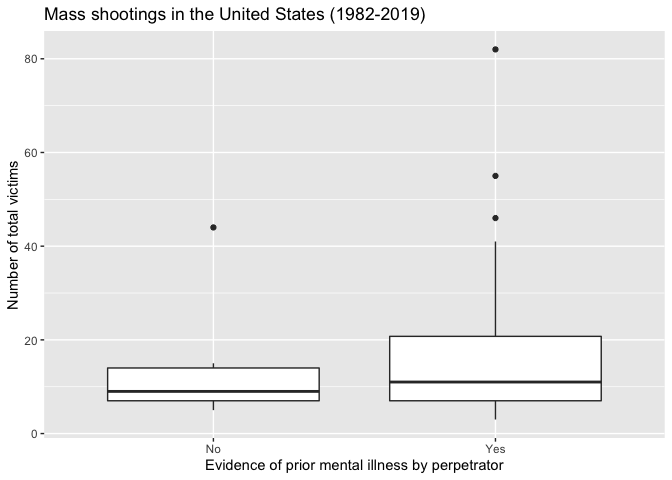<!-- -->

``` r
# Plot 2: Relationship between Race and Total Victimes
race_without_na <- filter(.data = mass_shootings, !is.na(race))

plot <- ggplot(data = race_without_na, 
       mapping = aes(x = race, y = total_victims)) +
  geom_boxplot() +
  labs(title = "Mass shootings in the United States (1982-2019)") +
  labs(x = "Race of perpetrator", y = "Total number of victims")

plot 
```

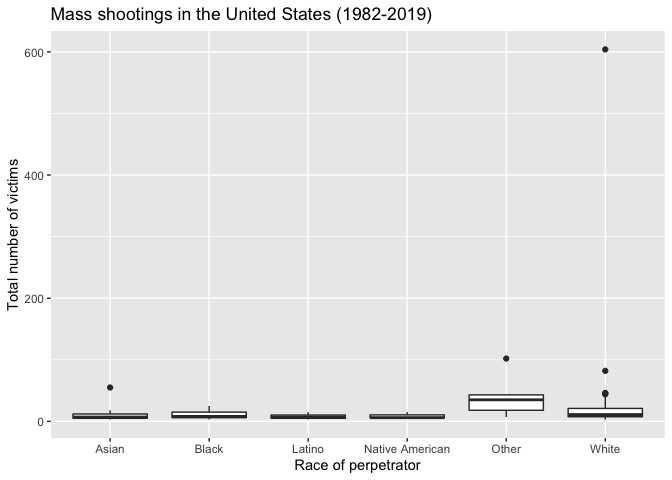<!-- -->

``` r
# Plot 3: Setting limit on Y-axis to get a closer look
plot + ylim(0,100)
```

    ## Warning: Removed 2 rows containing non-finite values (stat_boxplot).

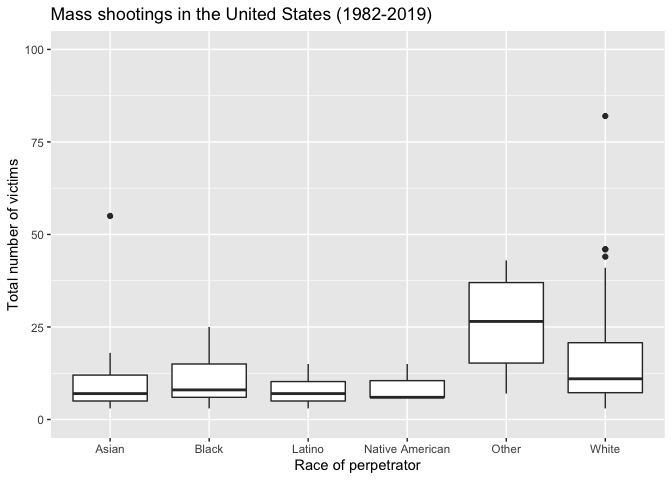<!-- -->

``` r
# Plot 4: Omitting Las Vegas Strip massacre to see relationship between Race and Total Victimes

omitted_lvstrip <- filter(.data = mass_shootings, case!= "Las Vegas Strip massacre" )

ggplot(data = omitted_lvstrip, 
       mapping = aes(x = race, y = total_victims)) +
  geom_boxplot() +
  labs(title = "Mass shootings in the United States (1982-2019)", subtitle = "Omitting Las Vegas Strip Massacre (2017") +
  labs(x = "Race of perpetrator", y = "Total number of victims")
```

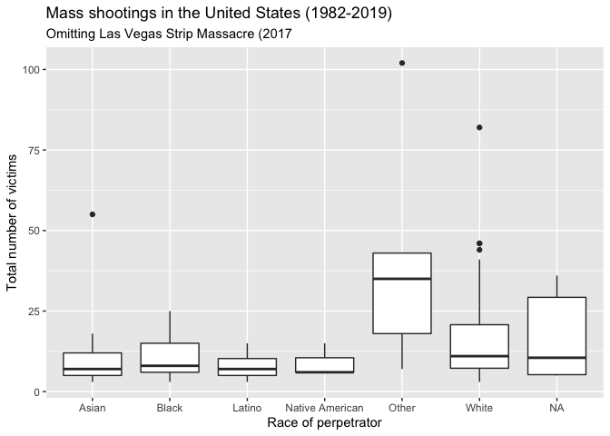<!-- -->

``` r
# Plot 5: Intersection of Race, Total Victims and Prior Mental Illness

clean_data <- filter(.data = mass_shootings, race!= "Other" & !is.na(race) & !is.na(prior_mental_illness))
  
ggplot(data = clean_data, mapping = aes(x = total_victims, y = race, fill = prior_mental_illness)) +
  geom_boxplot() + 
  labs(title = "Mass shootings in the United States (1982-2019)") +
  labs(x = "Number of total victims", y = "Race of perpetrator") + 
  labs(fill = "Evidence of prior mental illness") + 
  theme(legend.position = "bottom")
```

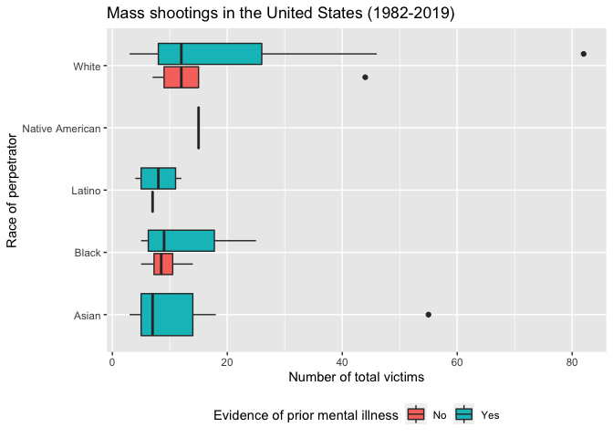<!-- -->

``` r
# Plot 6: Another intersection of Race, Total Victims and Prior Mental Illness

clean_data <- filter(.data = mass_shootings, race!= "Other" & !is.na(race) & !is.na(prior_mental_illness))

ggplot(data = clean_data, mapping = aes(x = prior_mental_illness, y = total_victims, fill = race)) +
  geom_boxplot() + 
  labs(title = "Mass shootings in the United States (1982-2019)") +
  labs(x = "Evidence of prior mental illness", y = " Number of total victims") + 
  labs(fill = "Race of perpetrator") + 
  theme(legend.position = "bottom")
```

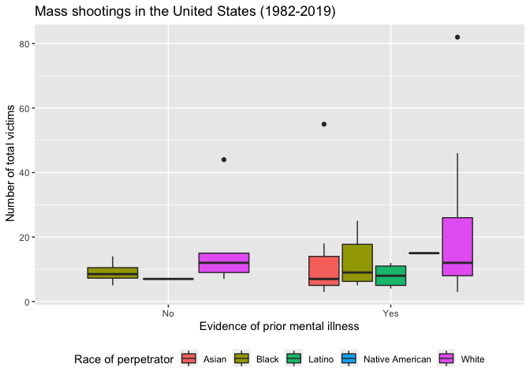<!-- -->

**Answer**:

  - From Plot 5, those with prior mental illesses have a longer box
    plots as well as longer whiskers when compared to those with no
    evidence of prior mental illness. This implies more variance in the
    total number of victims. Moreover, the outliers are also larger for
    those with prior mental illness. In contrast, the minimum value of
    total number of victims for those with prior mental illness is also
    smaller than those without. Moreover, the median values for both
    with and without illnesses is not very different. This leads to the
    conclusion that those with prior mental illnesses are more likely to
    be shooters, but also that their behaviour seems to be more sporadic
    and variable than those with no prior mental illness. This is also
    confirmed from Plot 1, where the medians are very close, but
    perpetrators with prior mental illnesses have higher maximum values,
    lower minimum values and larger variance.

  - From Plot 6, having a mental illness creates perpetrators from all 5
    races, whereas those with no prior mental illness belong to only 3
    races. Moreover, having a mental illness leads to larger variance as
    mentioned
    above.

## Session info

``` r
devtools::session_info()
```

    ## ─ Session info ───────────────────────────────────────────────────────────────
    ##  setting  value                       
    ##  version  R version 3.6.3 (2020-02-29)
    ##  os       macOS Catalina 10.15.4      
    ##  system   x86_64, darwin15.6.0        
    ##  ui       X11                         
    ##  language (EN)                        
    ##  collate  en_US.UTF-8                 
    ##  ctype    en_US.UTF-8                 
    ##  tz       Asia/Kolkata                
    ##  date     2020-04-20                  
    ## 
    ## ─ Packages ───────────────────────────────────────────────────────────────────
    ##  package     * version date       lib source                        
    ##  assertthat    0.2.1   2019-03-21 [1] CRAN (R 3.6.0)                
    ##  backports     1.1.6   2020-04-05 [1] CRAN (R 3.6.2)                
    ##  broom         0.5.5   2020-02-29 [1] CRAN (R 3.6.0)                
    ##  callr         3.4.3   2020-03-28 [1] CRAN (R 3.6.2)                
    ##  cellranger    1.1.0   2016-07-27 [1] CRAN (R 3.6.0)                
    ##  cli           2.0.2   2020-02-28 [1] CRAN (R 3.6.0)                
    ##  colorspace    1.4-1   2019-03-18 [1] CRAN (R 3.6.0)                
    ##  crayon        1.3.4   2017-09-16 [1] CRAN (R 3.6.0)                
    ##  DBI           1.1.0   2019-12-15 [1] CRAN (R 3.6.0)                
    ##  dbplyr        1.4.3   2020-04-19 [1] CRAN (R 3.6.3)                
    ##  desc          1.2.0   2018-05-01 [1] CRAN (R 3.6.0)                
    ##  devtools      2.3.0   2020-04-10 [1] CRAN (R 3.6.3)                
    ##  digest        0.6.25  2020-02-23 [1] CRAN (R 3.6.0)                
    ##  dplyr       * 0.8.5   2020-03-07 [1] CRAN (R 3.6.0)                
    ##  ellipsis      0.3.0   2019-09-20 [1] CRAN (R 3.6.0)                
    ##  evaluate      0.14    2019-05-28 [1] CRAN (R 3.6.0)                
    ##  fansi         0.4.1   2020-01-08 [1] CRAN (R 3.6.0)                
    ##  farver        2.0.3   2020-01-16 [1] CRAN (R 3.6.0)                
    ##  forcats     * 0.5.0   2020-03-01 [1] CRAN (R 3.6.0)                
    ##  fs            1.4.1   2020-04-04 [1] CRAN (R 3.6.2)                
    ##  generics      0.0.2   2018-11-29 [1] CRAN (R 3.6.0)                
    ##  ggplot2     * 3.3.0   2020-03-05 [1] CRAN (R 3.6.0)                
    ##  glue          1.4.0   2020-04-03 [1] CRAN (R 3.6.2)                
    ##  gtable        0.3.0   2019-03-25 [1] CRAN (R 3.6.0)                
    ##  haven         2.2.0   2019-11-08 [1] CRAN (R 3.6.0)                
    ##  highr         0.8     2019-03-20 [1] CRAN (R 3.6.0)                
    ##  hms           0.5.3   2020-01-08 [1] CRAN (R 3.6.0)                
    ##  htmltools     0.4.0   2019-10-04 [1] CRAN (R 3.6.0)                
    ##  httr          1.4.1   2019-08-05 [1] CRAN (R 3.6.0)                
    ##  jsonlite      1.6.1   2020-02-02 [1] CRAN (R 3.6.0)                
    ##  knitr       * 1.28    2020-02-06 [1] CRAN (R 3.6.0)                
    ##  labeling      0.3     2014-08-23 [1] CRAN (R 3.6.0)                
    ##  lattice       0.20-38 2018-11-04 [1] CRAN (R 3.6.3)                
    ##  lifecycle     0.2.0   2020-03-06 [1] CRAN (R 3.6.0)                
    ##  lubridate     1.7.8   2020-04-06 [1] CRAN (R 3.6.2)                
    ##  magrittr      1.5     2014-11-22 [1] CRAN (R 3.6.0)                
    ##  memoise       1.1.0   2017-04-21 [1] CRAN (R 3.6.0)                
    ##  modelr        0.1.6   2020-02-22 [1] CRAN (R 3.6.0)                
    ##  munsell       0.5.0   2018-06-12 [1] CRAN (R 3.6.0)                
    ##  nlme          3.1-144 2020-02-06 [1] CRAN (R 3.6.3)                
    ##  pillar        1.4.3   2019-12-20 [1] CRAN (R 3.6.0)                
    ##  pkgbuild      1.0.6   2019-10-09 [1] CRAN (R 3.6.0)                
    ##  pkgconfig     2.0.3   2019-09-22 [1] CRAN (R 3.6.0)                
    ##  pkgload       1.0.2   2018-10-29 [1] CRAN (R 3.6.0)                
    ##  prettyunits   1.1.1   2020-01-24 [1] CRAN (R 3.6.0)                
    ##  processx      3.4.2   2020-02-09 [1] CRAN (R 3.6.0)                
    ##  ps            1.3.2   2020-02-13 [1] CRAN (R 3.6.0)                
    ##  purrr       * 0.3.4   2020-04-17 [1] CRAN (R 3.6.2)                
    ##  R6            2.4.1   2019-11-12 [1] CRAN (R 3.6.0)                
    ##  rcfss       * 0.1.9   2020-04-19 [1] Github (uc-cfss/rcfss@6dd8d8b)
    ##  Rcpp          1.0.4.6 2020-04-09 [1] CRAN (R 3.6.3)                
    ##  readr       * 1.3.1   2018-12-21 [1] CRAN (R 3.6.0)                
    ##  readxl        1.3.1   2019-03-13 [1] CRAN (R 3.6.0)                
    ##  remotes       2.1.1   2020-02-15 [1] CRAN (R 3.6.0)                
    ##  reprex        0.3.0   2019-05-16 [1] CRAN (R 3.6.0)                
    ##  rlang         0.4.5   2020-03-01 [1] CRAN (R 3.6.0)                
    ##  rmarkdown     2.1     2020-01-20 [1] CRAN (R 3.6.0)                
    ##  rprojroot     1.3-2   2018-01-03 [1] CRAN (R 3.6.0)                
    ##  rstudioapi    0.11    2020-02-07 [1] CRAN (R 3.6.0)                
    ##  rvest         0.3.5   2019-11-08 [1] CRAN (R 3.6.0)                
    ##  scales        1.1.0   2019-11-18 [1] CRAN (R 3.6.0)                
    ##  sessioninfo   1.1.1   2018-11-05 [1] CRAN (R 3.6.0)                
    ##  stringi       1.4.6   2020-02-17 [1] CRAN (R 3.6.0)                
    ##  stringr     * 1.4.0   2019-02-10 [1] CRAN (R 3.6.0)                
    ##  testthat      2.3.2   2020-03-02 [1] CRAN (R 3.6.0)                
    ##  tibble      * 3.0.0   2020-03-30 [1] CRAN (R 3.6.2)                
    ##  tidyr       * 1.0.2   2020-01-24 [1] CRAN (R 3.6.0)                
    ##  tidyselect    1.0.0   2020-01-27 [1] CRAN (R 3.6.0)                
    ##  tidyverse   * 1.3.0   2019-11-21 [1] CRAN (R 3.6.0)                
    ##  usethis       1.6.0   2020-04-09 [1] CRAN (R 3.6.3)                
    ##  utf8          1.1.4   2018-05-24 [1] CRAN (R 3.6.0)                
    ##  vctrs         0.2.4   2020-03-10 [1] CRAN (R 3.6.0)                
    ##  withr         2.1.2   2018-03-15 [1] CRAN (R 3.6.0)                
    ##  xfun          0.13    2020-04-13 [1] CRAN (R 3.6.2)                
    ##  xml2          1.3.1   2020-04-09 [1] CRAN (R 3.6.2)                
    ##  yaml          2.2.1   2020-02-01 [1] CRAN (R 3.6.0)                
    ## 
    ## [1] /Library/Frameworks/R.framework/Versions/3.6/Resources/library
